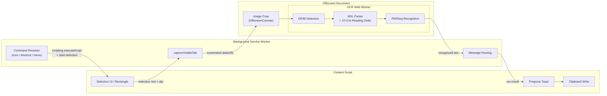

# NDLOCR-Lite Region-Select OCR (Chrome Extension)

[日本語版はこちら](README_ja.md)

[](https://chromewebstore.google.com/detail/offline-ocr/cfppiicaeemimcbodibggnnolckcpmpd)

A Chrome extension that runs fully offline, in-browser Japanese OCR using
[ndlocr-lite-wasm](https://github.com/tamoco-mocomoco/ndlocr-lite-wasm).
Select a region on any page with your mouse, and the recognized text is
automatically copied to your clipboard. No data ever leaves your browser.

## Features

- Launch from the toolbar icon, `Alt+Shift+O`, or the right-click context menu
- Drag to select a region (`Esc` to cancel)
- DEIM text-region detection → XY-Cut reading order → PARSeq character recognition
- Results are auto-copied via `navigator.clipboard.writeText` with a toast notification
- Models are cached in IndexedDB after the first load for fast subsequent runs

## Build

```sh
npm install
npm run build
```

The extension files are output to `dist/`.

## Load the Extension

1. Open `chrome://extensions/` in Chrome
2. Enable **Developer mode** (top right)
3. Click **Load unpacked** and select the `dist/` folder

## Usage

1. Open a page containing the text you want to OCR
2. Click the extension icon in the toolbar → **Start region selection**
   (or press `Alt+Shift+O`, or right-click → **Region-Select OCR (NDLOCR-Lite)**)
3. Drag to select the region
4. Wait a few seconds — progress toasts will appear, ending with **Copied (N chars)**
5. Paste anywhere

## Architecture



| Context | Source | Role |
|---|---|---|
| **Content Script** | `src/content/content.ts` | Selection overlay, progress toast, clipboard write |
| **Background SW** | `src/background/service-worker.ts` | Command aggregation, `captureVisibleTab` screenshot, forward to offscreen, return result to content |
| **Offscreen Document** | `src/offscreen/offscreen.ts` | ONNX Runtime Web cannot run inside a SW, so an offscreen document hosts the OCR Worker. Models are preloaded on startup |
| **OCR Worker** | `src/ocr/worker/ocr.worker.ts` | Ported from ndlocr-lite-wasm. Runs DEIM (detection) and PARSeq (recognition) via `onnxruntime-web/wasm` |

## File Size

| Component | Size |
|---|---|
| DEIM fp32 model | 38 MB |
| PARSeq fp32 model | 39 MB |
| ONNX Runtime WASM | 12 MB |
| JS / HTML / icons | < 1 MB |
| **Total (`dist/`)** | **~90 MB** |

Well within the Chrome Web Store upload limit (2 GB).

## Acknowledgements

The OCR engine and models in this extension are based on
[NDLOCR](https://github.com/ndl-lab/ndlocr_cli), researched, developed,
and published by the [National Diet Library of Japan (NDL)](https://ndl.go.jp/).
We deeply appreciate the NDL for openly sharing their high-accuracy Japanese OCR technology.

The lightweight web port
[ndlocr-lite-wasm](https://github.com/tamoco-mocomoco/ndlocr-lite-wasm)
serves as the foundation of this extension's OCR pipeline.

## License

- This repository: CC-BY-4.0 (inherited from ndlocr-lite-wasm)
- Model files: subject to the NDLOCR (National Diet Library) license
- ONNX Runtime Web: MIT
