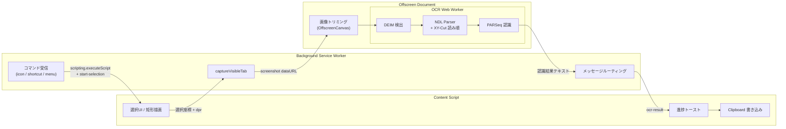

# NDLOCR-Lite 範囲選択OCR (Chrome拡張)

[English version](README.md)

[ndlocr-lite-wasm](https://github.com/tamoco-mocomoco/ndlocr-lite-wasm) を組み込み、
ブラウザ内ローカルで完結する範囲選択OCRを行うChrome拡張機能です。
画面をマウスで矩形選択 → ONNX Runtime Web で日本語OCR → 結果文字列を自動でクリップボードへコピー
します。サーバー通信は一切ありません。

## 機能

- ツールバーアイコン / `Alt+Shift+O` / 右クリックメニューの3経路から起動
- ドラッグで範囲選択 (`Esc` でキャンセル)
- DEIM で領域検出 → XY-Cut 読み順 → PARSeq で文字認識
- 結果を `navigator.clipboard.writeText` で自動コピーし、ページ右下にトースト表示
- モデルは初回ロード後 IndexedDB にキャッシュされ、2回目以降は高速

## ビルド

```sh
npm install
npm run build
```

`dist/` に Chrome に読み込ませるための拡張機能一式が出力されます。

## 拡張機能の読み込み

1. Chrome で `chrome://extensions/` を開く
2. 右上の「デベロッパーモード」を ON
3. 「パッケージ化されていない拡張機能を読み込む」をクリックし、`dist/` フォルダを選択

## 使い方

1. OCRしたいページを開く
2. ツールバーの拡張機能アイコンをクリック → ポップアップの「範囲選択を開始」
   (または `Alt+Shift+O`、ページ右クリック → 「範囲選択OCR (NDLOCR-Lite)」)
3. ドラッグで範囲を選択
4. 数秒〜十数秒で進捗トーストが進み、最後に「コピーしました (N文字)」と表示
5. 任意の場所にペースト

## アーキテクチャ



| コンテキスト | ソース | 役割 |
|---|---|---|
| **Content Script** | `src/content/content.ts` | 選択オーバーレイ、進捗トースト、クリップボード書き込み |
| **Background SW** | `src/background/service-worker.ts` | 起動コマンド集約、`captureVisibleTab` でスクリーンショット取得、offscreen へ転送、結果を content へ返却 |
| **Offscreen Document** | `src/offscreen/offscreen.ts` | ONNX Runtime Web は SW 内で動かないため `chrome.offscreen` で非表示ドキュメントを立て、OCR Worker をホスト。起動時にモデルをプリロード |
| **OCR Worker** | `src/ocr/worker/ocr.worker.ts` | ndlocr-lite-wasm から移植。`onnxruntime-web/wasm` で DEIM（検出）と PARSeq（認識）を実行 |

## ファイルサイズ

| 内訳 | サイズ |
|---|---|
| DEIM fp32 モデル | 38 MB |
| PARSeq fp32 モデル | 39 MB |
| ONNX Runtime WASM | 12 MB |
| その他JS/HTML/icons | < 1 MB |
| **合計 (`dist/`)** | **約 90 MB** |

Chrome Web Store のアップロード上限 (2GB) に十分収まります。

## 謝辞

本拡張機能の OCR エンジンおよびモデルは、[国立国会図書館 (NDL)](https://ndl.go.jp/) が研究・開発・公開した [NDLOCR](https://github.com/ndl-lab/ndlocr_cli) をベースにしています。
高精度な日本語 OCR 技術をオープンに公開してくださった国立国会図書館に深く感謝いたします。

また、NDLOCR の軽量 Web 版である [ndlocr-lite-wasm](https://github.com/tamoco-mocomoco/ndlocr-lite-wasm) を本拡張の OCR パイプラインの基盤として使用しています。

## ライセンス

- 本リポジトリ: ndlocr-lite-wasm を継承し CC-BY-4.0
- モデルファイル: NDLOCR (国立国会図書館) のライセンスに従う
- ONNX Runtime Web: MIT
