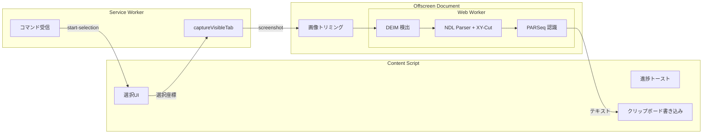

## はじめに

画像やPDFのテキストをコピーしたいとき、オンラインのOCRサービスに画像を送るのはちょっと抵抗がありませんか？ 特に社外秘の資料や個人情報が写っている場合。

**通信ゼロ、ブラウザの中だけで完結するOCR** があれば安心して使えるのに — そう思って、Chrome拡張機能を作りました。

以前からいくつかの日本語OCRを試してきて、ブラウザ内でも実用レベルで動くことがわかっていたので、それを誰でも気軽に使える形にしたかったのが動機です。

- [yomitokuで作る日本語OCR Webアプリ](https://zenn.dev/lecto/articles/b345c7f3920ae9) — サーバーサイドで高精度な日本語OCR
- [Tesseract.jsでカスタムモデルのトレーニング](https://zenn.dev/lecto/articles/b2a42b8fddef49) — ブラウザOCRの可能性と限界
- [ブラウザだけで完結する日本語OCR＋透視変換](https://zenn.dev/lecto/articles/dea43a2dfa52ad) — NDLOCRをブラウザで動かす

https://chromewebstore.google.com/detail/offline-ocr/cfppiicaeemimcbodibggnnolckcpmpd

Chrome Web Store で「**オフラインOCR**」と検索してもヒットします。

https://github.com/tamoco-mocomoco/offline-ocr

## これまでのOCRの投稿を振り返り

### yomitoku: サーバーサイドの高精度OCR

最初に試したのは [yomitoku](https://zenn.dev/lecto/articles/b345c7f3920ae9) でした。Flask + Docker Compose で日本語OCR Webアプリを構築。Paragraphs（段落単位）とWords（単語単位）の2つの粒度で認識でき、EasyOCRと比較しても日本語の認識精度は圧倒的でした。

ただ、課題がありました。

- **サーバーが必要** — ローカルでDockerを立てるか、クラウドにデプロイするか
- **商用ライセンス** — 個人・研究用途は無償だが、商用利用は有償
- **画像データの送信** — 機密文書をサーバーに送ることへの心理的抵抗

### Tesseract.js: ブラウザOCRとカスタムモデル

次に [Tesseract.js](https://zenn.dev/lecto/articles/b2a42b8fddef49) を試しました。ブラウザ内で動くので、データ送信の問題は解消。カスタムモデルのトレーニング環境まで構築し、LSTM fine-tuning も試みました。

しかし、日本語の認識精度が実用レベルに達しませんでした。ホワイトリストで認識対象を絞る工夫はできるものの、汎用的な日本語文書に対してはyomitokuに遠く及ばない。

### ndlocr-lite-wasm: ブラウザ完結 × 高精度

そして [ndlocr-lite-wasm](https://zenn.dev/lecto/articles/dea43a2dfa52ad) にたどり着きました。国立国会図書館のNDLOCRをONNX Runtime Web で動かすことで、**ブラウザ完結 × 日本語高精度** を実現。透視変換（台形補正）もOpenCV.jsなしでPure TypeScriptで実装し、斜めから撮った文書もOCRできるようにしました。

この時点で「これはもっと手軽に使える形にすべきだ」と確信しました。

### もっと気軽に使える形にしたい

ここまでの試行錯誤で「ブラウザ内OCRは実用レベルで動く」とわかりました。あとは**手軽さ**の問題です：

| 要件                 | yomitoku | Tesseract.js | ndlocr-lite | **Chrome拡張** |
| -------------------- | -------- | ------------ | ----------- | -------------- |
| サーバー不要         | ✕        | ○            | ○           | **○**          |
| 日本語精度           | ◎        | △            | ○           | **○**          |
| 手軽さ               | △        | △            | △           | **◎**          |
| 通信ゼロ             | ✕        | ○            | ○           | **○**          |
| どのページでも使える | ✕        | ✕            | ✕           | **◎**          |

Webアプリだと「画像をアップロードして結果を待つ」フローが必須ですが、Chrome拡張なら **今見ているページ上で直接範囲選択してコピー** できます。インストールするだけで、あとはどのページでもすぐ使えます。

## 作ったもの


画面上のテキストをマウスで囲むだけで、認識してクリップボードに自動コピーする拡張機能です。
ローカルの画像やPDFファイルも、Chromeにドラッグ&ドロップで開けばそのままOCRできます。

1. 拡張アイコンをクリック（または `Alt+Shift+O`、右クリックメニュー）
2. OCRしたい範囲をドラッグで選択
3. 数秒で認識結果がクリップボードにコピー

ショートカットキーは `chrome://extensions/shortcuts` から好きなキーに変更できます。

**それだけです。** 通信は一切ありません。


### こんな場面で使える

- スクリーンショット内のテキストをコピーしたい
- PDF化された請求書の金額を素早く取り出したい
- トレカ（MTG、ポケカ、遊戯王）画像のカード名や効果テキストをコピーしたい
- ボタンやリンクになっているテキストを、クリックせずにコピーしたい
- 社外秘の文書を外部サービスに送りたくない

## アーキテクチャ

Manifest V3 のChrome拡張は制約が多く、「普通にJSを書けばいい」とはいきません。特に **ONNX Runtime Web（WASM）をどこで動かすか** が設計の最大のポイントでした。



### なぜ3つのコンテキストに分けるのか

**Service Worker** はMV3の中心ですが、DOMもCanvasもありません。WASMの実行もできません。

**Content Script** はページ内で動けますが、重い推論処理を走らせるとページが固まります。

**Offscreen Document** がこの問題を解決します。MV3で追加されたこの仕組みで、非表示のHTMLドキュメントを裏に立てて、Web Worker + WASMを走らせることができます。

```typescript
await chrome.offscreen.createDocument({
  url: "offscreen.html",
  reasons: ["WORKERS"],
  justification: "Run ONNX Runtime Web for OCR inference",
});
```

[前回の記事](https://zenn.dev/lecto/articles/dea43a2dfa52ad)ではWebアプリとして直接ONNX Runtimeを動かしていましたが、拡張機能ではこのOffscreen Document経由にする必要がありました。

## OCRパイプライン

前回のndlocr-lite-wasmの記事で実装したパイプラインを、そのままChrome拡張に移植しています。

### 1. DEIM（テキスト領域検出）

入力画像を正方形にパディング → 1024×1024にリサイズ → ImageNet正規化 → DEIMでテキスト行・ブロックの位置を検出。NDLOCRのクラス体系に従い、本文、キャプション、広告、割注など17種類を識別します。

### 2. NDL Parser + XY-Cut（構造解析 + 読み順）

検出結果を構造化ツリーに変換し、XY-Cutアルゴリズムで日本語の読み順を決定します。縦書き（右→左）と横書き（左→右）を自動判定するのは[前回の記事](https://zenn.dev/lecto/articles/dea43a2dfa52ad)と同じロジックです。

### 3. PARSeq（文字認識）

各テキスト行を768×32にリサイズし（縦書きの場合は90度回転）、PARSeqで文字認識。NDLが日本語（手書き含む）データで学習したモデルを使用しています。

## 拡張機能で追加した機能

ndlocr-lite-wasmからの移植に加え、Chrome拡張ならではの機能を追加しました。

### クリーニングルール


OCR結果をそのままコピーすると、カンマやスペースが含まれることがあります。これを正規表現ベースのルールで自動整形できます。

```
Before: ¥1,234,567
After:  1234567
```

設定画面で自由にルールを追加・並べ替えできます。

```typescript
export function applyCleaningRules(
  text: string,
  rules: CleaningRule[],
): string {
  let out = text;
  for (const rule of rules) {
    if (!rule.enabled || !rule.pattern) continue;
    try {
      const re = new RegExp(rule.pattern, rule.flags || "");
      out = out.replace(re, rule.replacement);
    } catch {
      // 無効な正規表現はスキップ（パイプラインを止めない）
    }
  }
  return out;
}
```

特に [yomitokuの記事](https://zenn.dev/lecto/articles/b345c7f3920ae9) で請求書OCRを試した経験から、**数値のカンマ除去は必須機能** だと感じていました。

### モデルキャッシュ

OCRモデルは合計約77MBあります。毎回ロードすると20秒以上かかるため、初回ロード後にIndexedDBにキャッシュする仕組みを入れています。2回目以降はミリ秒で起動します。

### 3通りの起動方法

- ツールバーアイコン
- キーボードショートカット `Alt+Shift+O`
- 右クリックメニュー

[Tesseract.jsの記事](https://zenn.dev/lecto/articles/b2a42b8fddef49)で「モデルの事前ロード」を実装した経験が活きています。ユーザーがアクションを起こす前にモデルをウォームアップしておくことで、体感的な待ち時間を削減しています。

## 開発で苦労したポイント

### Service Worker → Offscreen → Worker のメッセージリレー

3つのコンテキスト間でメッセージをリレーする必要があります。`chrome.runtime.sendMessage` ではバイナリ（ArrayBuffer）を直接送れないため、スクリーンショット画像はData URL（Base64）で受け渡しています。

```
Service Worker: captureVisibleTab() → Data URL
    ↓ chrome.runtime.sendMessage
Offscreen: Data URL → crop → Worker.postMessage
    ↓ Worker内で推論
Worker: テキスト結果 → postMessage
    ↓ chrome.runtime.sendMessage
Service Worker → Content Script: 結果テキスト
```

### Worker内でのモデルURL解決

Web Worker内では `chrome.runtime.getURL()` が使えません。Offscreen Document側でモデルの絶対URLを解決し、`configure` メッセージでWorkerに渡す設計にしました。

これは[ndlocr-lite-wasmの記事](https://zenn.dev/lecto/articles/dea43a2dfa52ad)ではWebアプリだったので発生しなかった、拡張機能特有の問題でした。

### wasm-unsafe-eval

ONNX Runtime Web は WebAssembly を動的にコンパイルするため、CSPに `wasm-unsafe-eval` が必要です。

```json
"content_security_policy": {
  "extension_pages": "script-src 'self' 'wasm-unsafe-eval'; object-src 'self'"
}
```

## テスト

vitestでユニットテストを書いています。ブラウザAPI非依存の純粋ロジック部分を中心にカバーしています。

```
Tests: 67 passed (8 test files)
Duration: 345ms
```

テスト対象：

- **ndl-parser** — 検出結果 → 構造化ツリー変換
- **xy-cut** — 読み順アルゴリズム（横書き/縦書き）
- **reorder / smooth-order** — 行ソートと平滑化
- **warichu** — 割注グルーピング
- **cleaning** — 正規表現クリーニングルール
- **tensor-utils** — テンソル前処理（HWC↔CHW変換、正規化）

## ファイルサイズ

| 内訳                 | サイズ       |
| -------------------- | ------------ |
| DEIM fp32 モデル     | 38 MB        |
| PARSeq fp32 モデル   | 39 MB        |
| ONNX Runtime WASM    | 12 MB        |
| JS / HTML / アイコン | < 1 MB       |
| **合計**             | **約 90 MB** |

正直デカいです。ただ Chrome Web Store の上限は2GBなので、
100MB超えなければ許容範囲かと・・・

## まとめ

「画像のテキストをコピーしたいけど、外部に送るのは不安」という場面は意外と多いです。この拡張機能なら、通信ゼロで安心して使えます。インストールするだけで特に設定も不要なので、気軽に試してみてください。

https://chromewebstore.google.com/detail/offline-ocr/cfppiicaeemimcbodibggnnolckcpmpd

ソースコードはGitHubで公開しています。

https://github.com/tamoco-mocomoco/offline-ocr

## 謝辞

- [国立国会図書館 (NDL)](https://ndl.go.jp/) — NDLOCRの研究・開発・公開
- [ndlocr-lite-wasm](https://github.com/tamoco-mocomoco/ndlocr-lite-wasm) — NDLOCRの軽量Web版
