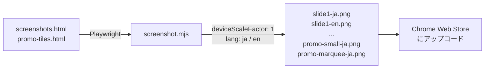
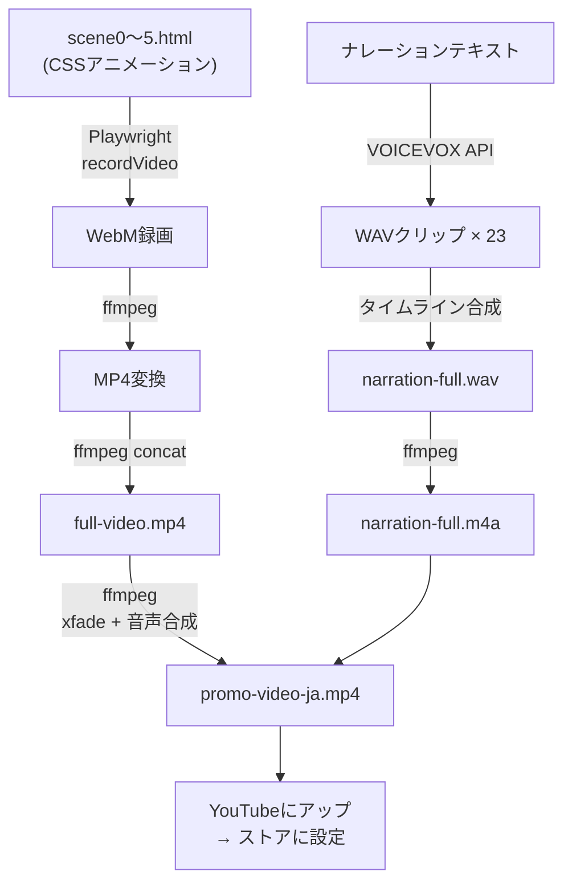
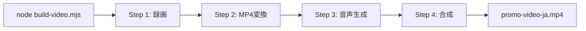

## はじめに

Chrome拡張機能を作って、いざChrome Web Storeに公開しようとすると、意外なハードルに直面します。

**ストア掲載に必要な素材が多い。**

- スクリーンショット（1280×800）を最低1枚、できれば5枚
- プロモーションタイル（小: 440×280、マーキー: 1400×560）
- プロモーション動画（YouTube URL）
- 多言語対応する場合は日英それぞれ

どうしよう、と思ってまず**他の拡張機能のストアページを調べてみました**。

すると意外なことがわかりました。**実際のアプリ画面をそのままキャプチャして載せている拡張はむしろ少ない**。人気のある拡張機能の多くが、イラストやモックアップを使って「こう使えます」「こんな機能があります」という概念を伝えるスライド形式のスクリーンショットを載せていました。

つまり、スクリーンショットと言いつつも求められているのは**使い方や価値が一目で伝わるビジュアル**であって、リアルな画面キャプチャである必要はなかった。

それなら、Figmaで1枚ずつ作るよりも、**HTMLで書いてしまった方が早いのでは？** しかも拡張機能の中身を一緒に作ってきた**Claude（Claude Code）なら、機能の見せ方も含めて作ってくれるのでは？**

実際に頼んでみたら、モックブラウザ、操作ステップ、Before/After比較といったスライド構成をCSSアニメーション付きで生成してくれました。機能を理解しているからこそ「何を見せるべきか」の判断も含めて任せられる。これがかなり楽でした。

そこで今回、**HTML + CSSアニメーションでストア素材を作り、Playwrightで自動キャプチャ、VOICEVOXでナレーション生成、ffmpegで動画合成** という完全コード駆動のパイプラインを構築しました。その過程を紹介します。

https://chromewebstore.google.com/detail/offline-ocr/cfppiicaeemimcbodibggnnolckcpmpd

https://github.com/tamoco-mocomoco/offline-ocr

## 全体像

```
store/
├── screenshots.html          ← スクリーンショット5枚分のHTML
├── promo-tiles.html           ← プロモタイル（小 + マーキー）
└── video/
    ├── scene0-title.html      ← 動画シーン（タイトル）
    ├── scene1-demo.html       ← 動画シーン（操作デモ）
    ├── scene2-features.html   ← 動画シーン（特徴一覧）
    ├── scene3-privacy.html    ← 動画シーン（プライバシー）
    ├── scene4-cleaning.html   ← 動画シーン（クリーニングルール）
    ├── scene5-architecture.html ← 動画シーン（アーキテクチャ）
    ├── scene*-en.html         ← 英語版（同じCSS、テキストだけ翻訳）
    ├── screenshot.mjs         ← Playwrightでキャプチャ
    ├── build-video.mjs        ← 録画 + 音声生成 + 結合
    ├── generate-voice.mjs     ← VOICEVOXナレーション生成
    └── merge.sh               ← ffmpegでクロスフェード合成
```

素材はすべてHTMLで定義し、スクリプトで画像・動画に変換します。テキストを変えたければHTMLを編集してスクリプトを再実行するだけ。

### スクリーンショットの生成フロー



### 動画の生成フロー



### ワンコマンドで全工程



## スクリーンショットをHTMLで作る

### なぜHTMLなのか

Figmaやデザインツールで作ることもできますが、こんな問題があります：

- テキスト修正のたびにFigmaを開いて手作業
- 多言語対応すると画面数が倍になる
- デザインの統一感を保つのが面倒
- バージョン管理しにくい（バイナリファイル）

HTMLなら：

- **テキスト修正はコード変更だけ** — gitで差分管理もできる
- **多言語対応は `data-lang` 属性で切り替え** — 1ファイルで日英両対応
- **デザインはCSS変数で統一** — 色やフォントを一箇所で管理
- **Playwrightで自動キャプチャ** — コマンド一発で全画像生成

### 実装: screenshots.html

1枚のHTMLに5つの「スライド」を並べています。各スライドは1280×800のdivです。

```html
<!-- 1枚のHTMLに5スライド -->
<div class="slide slide-1">...</div>  <!-- 操作デモ -->
<div class="slide slide-2">...</div>  <!-- 特徴一覧 -->
<div class="slide slide-3">...</div>  <!-- プライバシー -->
<div class="slide slide-4">...</div>  <!-- クリーニング -->
<div class="slide slide-5">...</div>  <!-- アーキテクチャ -->
```

### 多言語対応

`data-lang-ja` / `data-lang-en` 属性で日英を切り替えます。

```html
<span data-lang-ja><h1>オフラインOCR</h1></span>
<span data-lang-en><h1>Offline OCR</h1></span>
```

```css
[data-lang-en] { display: none; }
[data-lang-ja] { display: initial; }
body.lang-en [data-lang-en] { display: initial; }
body.lang-en [data-lang-ja] { display: none; }
```

`body` に `lang-en` クラスを付けるだけで全テキストが英語に切り替わります。

### Playwrightで自動キャプチャ

```javascript
// screenshot.mjs
const context = await browser.newContext({
  viewport: { width: 1280, height: 900 },
  deviceScaleFactor: 1,  // Retinaでもピクセル等倍
});
const page = await context.newPage();
await page.goto(fileUrl, { waitUntil: "networkidle" });

// UIを非表示にしてからキャプチャ
await page.evaluate(() => {
  document.querySelector(".top-bar").style.display = "none";
  document.querySelectorAll(".slide").forEach((s) => {
    s.style.width = "1280px";
    s.style.height = "800px";
  });
});

// 各スライドを個別にスクリーンショット
for (let i = 1; i <= 5; i++) {
  const slide = await page.$(\`.slide:nth-child(\${i})\`);
  await slide.screenshot({ path: \`slide\${i}-\${lang}.png\` });
}
```

ポイント：
- `deviceScaleFactor: 1` を指定しないと、Retinaディスプレイで2倍サイズになってしまう
- レスポンシブ対応したHTMLでも、キャプチャ時は固定サイズに強制
- 言語切り替えは `body.classList.add("lang-en")` だけ

### GitHub Pagesでティザーサイトにも

同じ `screenshots.html` をGitHub Pagesでも公開しています。レスポンシブCSSを追加してスマホでも見られるようにしつつ、Playwrightでのキャプチャ時は固定サイズに戻す設計です。

```yaml
# .github/workflows/pages.yml
- name: Prepare Pages site
  run: |
    cp store/screenshots.html _site/index.html
    cp store/privacy-policy.html _site/privacy-policy.html
```

1つのHTMLファイルが「ストア用スクリーンショットの元」と「ティザーサイト」を兼ねています。

## プロモーション動画をCSSアニメーションで作る

### シーン構成

動画は6つのHTMLシーンで構成しています。各シーンはCSSアニメーションだけで動きます。JavaScriptは不要。

```css
/* 要素が時間差で順番に出現するアニメーション */
.feature-card:nth-child(1) { animation: fadeSlideUp 0.6s ease forwards 4.8s; }
.feature-card:nth-child(2) { animation: fadeSlideUp 0.6s ease forwards 9.5s; }
.feature-card:nth-child(3) { animation: fadeSlideUp 0.6s ease forwards 18.0s; }

@keyframes fadeSlideUp {
  from { opacity: 0; transform: translateY(20px); }
  to   { opacity: 1; transform: translateY(0); }
}
```

`animation-delay` でナレーションのタイミングに合わせて要素を出現させています。

### Playwrightで録画

Playwrightの `recordVideo` オプションでブラウザ画面をWebMに録画します。

```javascript
const context = await browser.newContext({
  viewport: { width: 1920, height: 1080 },
  recordVideo: {
    dir: recordingsDir,
    size: { width: 1920, height: 1080 },
  },
});
const page = await context.newPage();
await page.goto(fileUrl, { waitUntil: "load" });
await page.waitForTimeout(scene.duration); // アニメーション終了まで待つ
await context.close(); // これで録画が保存される
```

CSSアニメーションが時間通りに再生され、Playwrightがそのまま録画してくれます。

### VOICEVOXでナレーション生成

ナレーションは[VOICEVOX](https://voicevox.hiroshiba.jp/)のAPIを叩いて自動生成しています。

```javascript
const narrations = [
  { start: 1.5,  file: "scene0-01", text: "オフラインOCR。どこにも通信しない、安全な範囲選択OCRです。" },
  { start: 11.3, file: "scene1-01", text: "使い方はとてもシンプルです。" },
  // ...
];

for (const item of narrations) {
  // 1. テキスト→音声クエリ
  const query = await fetch(
    `${VOICEVOX_URL}/audio_query?text=${encodeURIComponent(item.text)}&speaker=${SPEAKER_ID}`,
    { method: "POST" }
  ).then(r => r.json());

  // 2. 音声合成
  const wav = await fetch(
    `${VOICEVOX_URL}/synthesis?speaker=${SPEAKER_ID}`,
    { method: "POST", body: JSON.stringify(query) }
  ).then(r => r.arrayBuffer());
}
```

各クリップの開始時刻（`start`）を指定して、無音のWAVに重ね合わせることで、1本のタイムライン音声を生成しています。

### タイミングの設計

ナレーションとCSSアニメーションのタイミングを合わせるのが最も重要です。手順は：

1. ナレーションテキストをVOICEVOXで生成して**実際の発話秒数を計測**
2. 発話秒数 + 余白をもとに**各ナレーションの開始時刻を決定**
3. 開始時刻に合わせてCSSの**animation-delayを設定**
4. 被りがないかスクリプトで自動チェック

```javascript
// タイミングの被りチェック
for (let i = 0; i < results.length - 1; i++) {
  const gap = results[i + 1].start - results[i].end;
  if (gap < 0) console.log("OVERLAP!");
}
```

### ffmpegで合成

最後にffmpegでシーン間のクロスフェード + ナレーション音声を合成します。

```bash
# クロスフェード付き結合
ffmpeg -y \
  -i scene0.mp4 -i scene1.mp4 -i scene2.mp4 ... \
  -filter_complex "[0:v][1:v]xfade=transition=fade:duration=0.8:offset=..." \
  -c:v libx264 -crf 18 faded-video.mp4

# ナレーション合成
ffmpeg -y \
  -i faded-video.mp4 -i narration-full.m4a \
  -c:v copy -c:a aac -shortest \
  promo-video-ja.mp4
```

### ワンコマンドで全工程

`build-video.mjs` で録画・変換・音声生成・合成を一気に実行できます。

```bash
node store/video/build-video.mjs              # 日本語版
node store/video/build-video.mjs --lang en    # 英語版
node store/video/build-video.mjs --video-only # 音声なし
node store/video/build-video.mjs --voice-only # 音声のみ再生成
```

## Claudeとの協業

実はこの仕組みの大部分は**Claude Code**と一緒に作りました。どう進めたかを振り返ると、こんな感じです。

### HTMLシーンの作成

「操作デモのシーンをこういう構成で作って」と伝えると、CSSアニメーション付きの完全なHTMLを生成してくれます。自分はブラウザでプレビューして「選択範囲の位置がずれてる」「マウスカーソルが後追いになって気持ち悪い」とフィードバックを返し、Claudeが修正する。このループが非常に速い。

6つのシーン × 日英 = 12ファイルを、ほぼ会話だけで作れました。

### タイミング調整

「英語版のナレーション、日本語と同じタイミングで被らない？」と聞くと、実際にVOICEVOXで生成して発話秒数を計測するスクリプトを書いて実行し、被りがないことを確認してくれます。

```
scene2-02 ends 65.4s → scene2-03 starts 65.5s  (gap: 0.1s) ⚠️ TIGHT
...
✓ No overlaps. Same timing can be used.
```

### 英語ナレーションの試行錯誤

英語版のナレーションをどうするかは、けっこう議論しました。

1. VOICEVOXで英語テキストをそのまま → イントネーションが変
2. カタカナに変換して読ませる → 「A Safe」が「エイセーフ」になる
3. カタカナを自然な日本語ミックスに → 海外の人が聞き取れない
4. 最終的に英語版はナレーションなし + SRT字幕に落ち着く

こういう「技術的にできるけど、ユーザー体験としてどうか」という判断を相談しながら進められるのがClaudeの良いところでした。

## プロモーションタイルも同じ仕組みで

小タイル（440×280）とマーキータイル（1400×560）も同じ要領です。1つのHTMLに両方のサイズを定義し、Playwrightで要素単位でキャプチャします。

```javascript
const tiles = [
  { id: "tile-small",   name: "promo-small" },
  { id: "tile-marquee", name: "promo-marquee" },
];

for (const tile of tiles) {
  const handle = await page.$(`#${tile.id}`);
  await handle.screenshot({ path: `${tile.name}-${lang}.png` });
}
```

## この仕組みのメリット

| 観点 | 手作業（Figma等） | コード駆動 |
|---|---|---|
| テキスト修正 | ツールを開いて手作業 | HTMLを編集して再実行 |
| 多言語対応 | ファイル数が倍 | data-lang属性で切替 |
| デザイン統一 | 手動で合わせる | CSS変数で一元管理 |
| バージョン管理 | バイナリで差分不明 | gitで差分が明確 |
| 動画更新 | 動画編集ソフトで再編集 | スクリプト再実行 |
| CI/CD | 不可 | GitHub Actionsで自動化可 |

特に**動画の更新が楽**なのが大きいです。テキストやタイミングの修正がコードの変更だけで済みます。

## まとめ

Chrome Web Storeの掲載素材は、一度作って終わりではなく、拡張機能のアップデートに合わせて更新が必要です。コード駆動にしておくと、更新のハードルが格段に下がります。

使った技術：
- **HTML + CSS** — 素材のデザインとアニメーション
- **Playwright** — スクリーンショット撮影と動画録画
- **VOICEVOX** — 日本語ナレーション自動生成
- **ffmpeg** — 動画のクロスフェード合成
- **Claude Code** — HTMLシーン生成、タイミング調整、スクリプト実装

ソースコードはGitHubで公開しています。`store/` ディレクトリ以下が今回紹介した仕組みの全体です。

https://chromewebstore.google.com/detail/offline-ocr/cfppiicaeemimcbodibggnnolckcpmpd

https://github.com/tamoco-mocomoco/offline-ocr

前回の記事：
https://zenn.dev/lecto/articles/（1本目のURL）

---

## 補足: もっと本格的にやるならRemotion

今回はHTML + CSSアニメーション + Playwrightという素朴な構成で動画を作りましたが、より本格的にコード駆動で動画制作をしたいなら **[Remotion](https://www.remotion.dev/)** という選択肢もあります。

Remotionは**React + TypeScriptで動画を作れるフレームワーク**です。

- Reactコンポーネントがそのまま動画のフレームになる
- タイムライン制御、シーン遷移、データ駆動の動画生成が得意
- Gitでバージョン管理でき、Reactエコシステムのライブラリも使える
- 個人・3人以下の企業は無料で商用利用可能

https://www.aquallc.jp/remotion-ai-video-guide/

ただ、ストア掲載用のスクリーンショットや短いプロモ動画くらいなら、今回紹介した**HTML + CSSだけの構成でも十分やれます**。Remotionの導入コストをかけるまでもないケースも多いので、まずはHTML + Playwrightで試してみて、物足りなくなったらRemotionに移行するくらいの温度感がちょうどいいかもしれません。

この仕組みはChrome拡張のストアに限らず、**プロモーション動画の素案作り、サービス紹介のモックアップ、SNS投稿用の短尺動画**など、「デザインツールを開くほどじゃないけど、それなりの見た目の素材がほしい」という場面で幅広く使えると思います。
